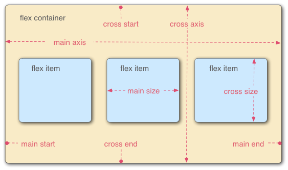

# Flexbox

## Useful links
* [Docs](https://css-tricks.com/snippets/css/a-guide-to-flexbox/)
* [Learning with fun](http://flexboxfroggy.com/)
* [Learning with fun 2](http://www.flexboxdefense.com/)

## Properties
### container:
* display: flex
* flex-direction
* justify-content
* flex-wrap
* flex-flow
* align-items
* align-content

### flex item:
* order
* flex-grow
* flex-shrink
* flex-basis
* flex
* align-self
 
 

  

